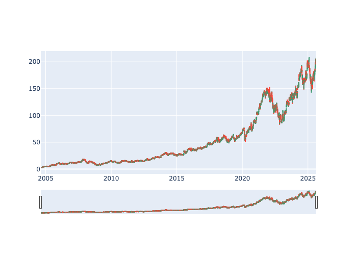

---
# Esto se llama "Front Matter", son las instrucciones para Jekyll
layout: page
title: Técnica 2 - Candlestick Chart
---

## Descripción de la técnica

Este tipo de gráfico se utiliza como una herramienta de trading para visualizar y analizar los movimientos de precios a lo largo del tiempo de valores, derivados, monedas, acciones, bonos, materias primas, etc. Aunque los símbolos usados en los gráficos de velas (Candlestick Charts) se parecen a un gráfico de caja (Box Plot), funcionan de manera diferente y, por lo tanto, no deben confundirse entre sí.

Los gráficos de velas muestran múltiples datos de precios como el precio de apertura, precio de cierre, el precio más alto y el más bajo mediante símbolos similares a velas. Cada símbolo representa la actividad de trading comprimida de un solo período de tiempo (un minuto, hora, día, mes, etc.). Cada símbolo de vela se traza a lo largo de una escala de tiempo en el eje x, para mostrar la actividad de trading a lo largo del tiempo.

## Dataset

He utilizado el siguiente dataset extraído de Kaggle:
	https://www.kaggle.com/datasets/umerhaddii/google-stock-data-2024

* **[Descargar el Dataset (CSV, 0,6MB)](./assets/datasets/GOOG_2004-08-19_2025-08-20.csv)**

## Código Python

Se utiliza el siguiente código para generar el gráfico:

* **[Descargar el fichero Python (.py)](./assets/code/generacion_candlestick_chart.py)**

## Gráficos y Visualizaciones

A continuación se muestran los gráficos generados a partir de los datos.
