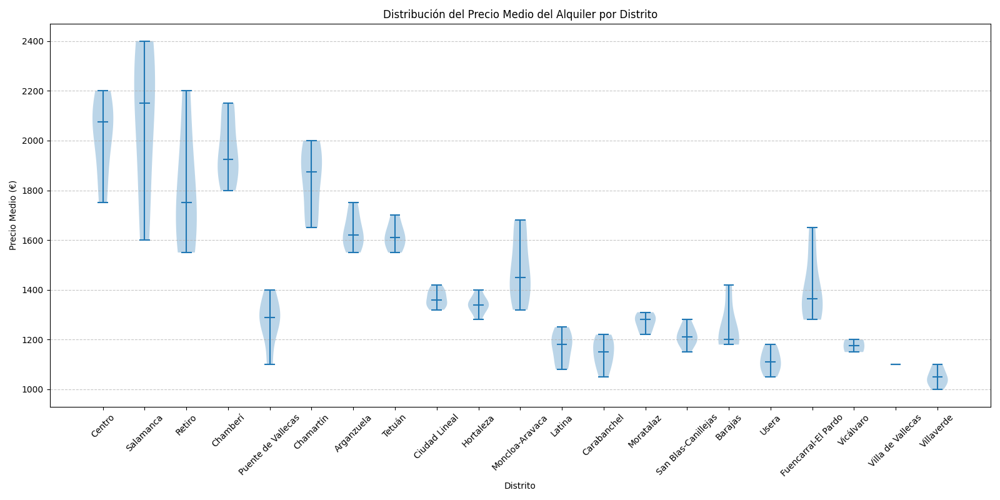
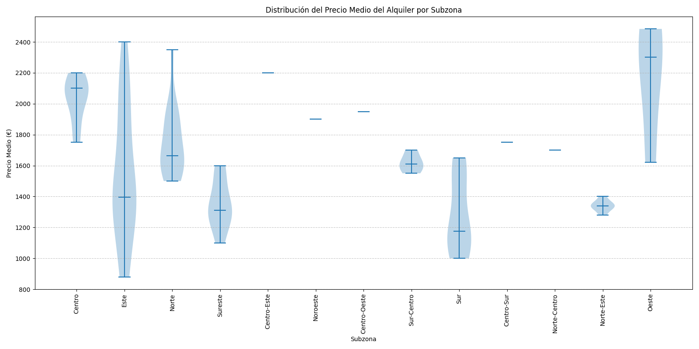
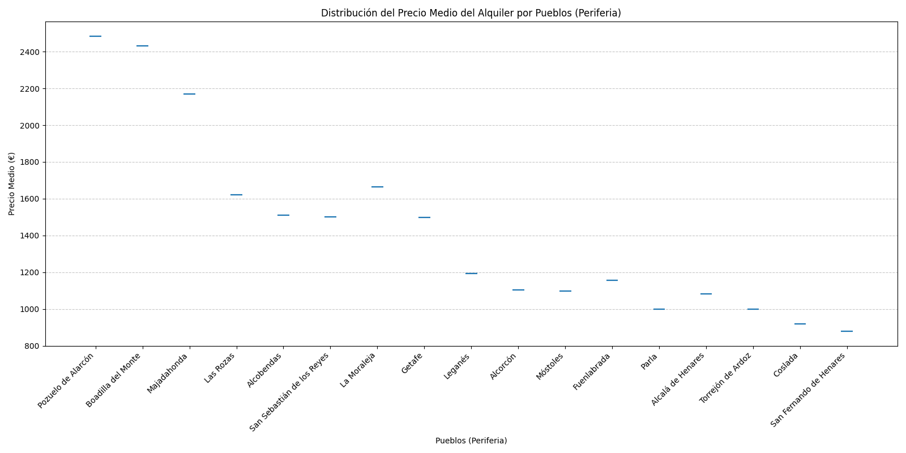

---
# Esto se llama "Front Matter", son las instrucciones para Jekyll
layout: page
title: Técnica 3 - Violin Plot
permalink: /violin_plot/
---

## Descripción de la técnica

Este gráfico es una combinación de un Box Plot y un Density Plot que está rotado y colocado a cada lado (para mostrar la forma de la distribución de los datos). El punto blanco en el centro es el valor mediano y la barra negra gruesa en el centro representa el rango intercuartílico. La línea negra delgada que se extiende desde ella representa los valores adyacentes máximos (superiores) y mínimos (inferiores) en los datos. A veces, el marcador del gráfico se recorta al final de esta línea.

Los diagramas de cajas (Box Plots) tienen limitaciones en la visualización de los datos, ya que su simplicidad visual tiende a ocultar detalles significativos acerca de cómo se distribuyen los valores en los datos. Por ejemplo, con los diagramas de cajas no se puede ver si la distribución es bimodal o multimodal. Mientras que los diagramas de violín (Violin Plots) muestran más información, pueden ser visualmente más ruidosos que los diagramas de cajas.

## Dataset

He utilizado el siguiente dataset extraído de Kaggle:
	https://www.kaggle.com/datasets/maximrz/precios-de-alquiler-por-barrio-en-madrid-2025

* **[Descargar el Dataset (JSON, 240KB)](./assets/datasets/barrios_madrid_oct25_fixed.json)**

## Código Python

Se utiliza el siguiente código para generar el gráfico:

* **[Descargar el fichero Python (.py)](./assets/code/generacion_violin_plot_distrito.py)**

## Gráficos y Visualizaciones

A continuación se muestran los gráficos generados a partir de los datos.

