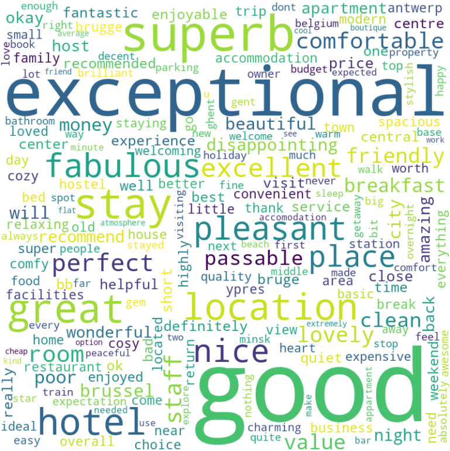

---
# Esto se llama "Front Matter", son las instrucciones para Jekyll
layout: page
title: Técnica 1 - Word Cloud
---

## Descripción de la técnica

Una nube de etiquetas es una representación visual para datos textuales,
típicamente usada para mostrar metadatos de palabras clave (tags) en sitios web,
para visualizar texto libre o para analizar discursos (por ejemplo, campañas
electorales). Los tags suelen ser palabras individuales, y la importancia de cada
tag se muestra con el tamaño de la fuente o el color. Este formato es útil para
percibir rápidamente los términos más prominentes y para localizar un término
alfabéticamente para determinar su prominencia relativa.

## Dataset

He utilizado el siguiente dataset extraído de Kaggle
	https://www.kaggle.com/datasets/michelhatab/hotel-reviews-bookingcom

* **[Descargar el Dataset (CSV, 15MB)](./assets/datasets/booking_reviews.csv)**

---

## Gráficos y Visualizaciones

A continuación se muestran los gráficos generados a partir de los datos.
